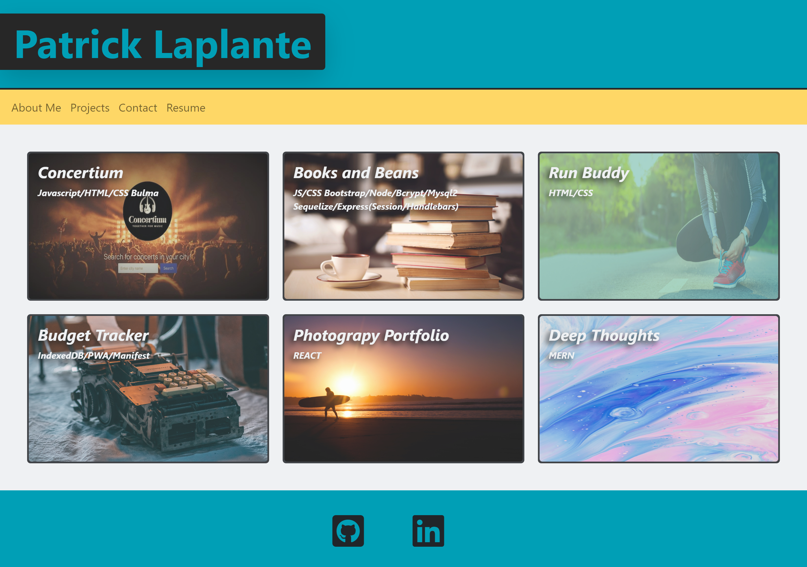

# 20 React: React Portfolio

## Description
Being a web developer means being part of a community. You’ll need a place not only to share your projects while you're applying for jobs or working as a freelancer but also to share your work with other developers and collaborate on projects.

I have created a portfolio using my new React skills which will help set me apart from other developers whose portfolios don’t use the latest technologies.

&nbsp;

---
## User Story

```md
AS AN employer looking for candidates with experience building single-page applications
I WANT to view a potential employee's deployed React portfolio of work samples
SO THAT I can assess whether they're a good candidate for an open position
```
&nbsp;

---
## Usage

Simply click on the Deployed GitHub Page link to take a look!  

&nbsp;

---
## Links

[GitHub Repository](https://github.com/MorningSol/react-portfolio)

[Deployed Github Page](http://MorningSol.github.io/react-portfolio/)

&nbsp;

---
## Application Screenshots

&nbsp;





